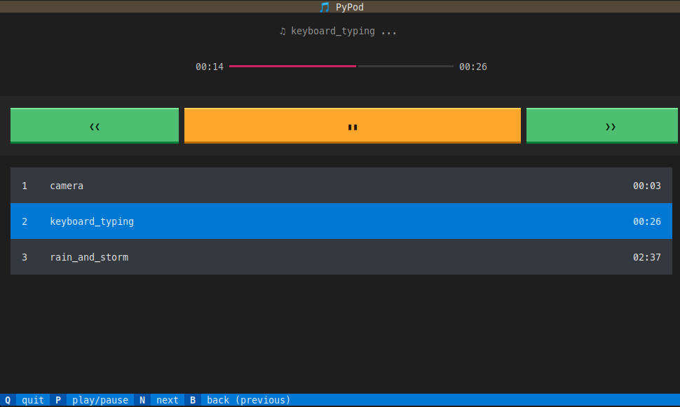

## PyPod

[](https://pypi.org/project/python-pod/)


[](https://github.com/pre-commit/pre-commit)
[](https://github.com/psf/black)
[](https://editorconfig.org/)
[](https://github.com/semantic-release/semantic-release)





Python console music player

### Installation

```bash
$ pip install python-pod
```

### Usage
```bash
$ pypod <path-to-directory>
$ pypod filename.wav
```

### Development

```bash
$ brew install portaudio
$ poetry install --with dev
```
